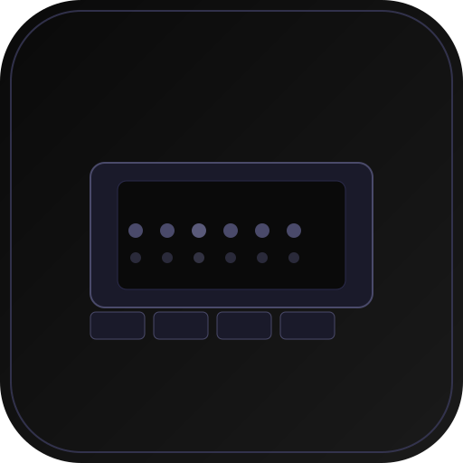

<div align="center">

<br/>

<!-- Logo -->


<h1>TerverPanel</h1>

<p>
  <strong>TerverPanel - Gaming Hosting Launcher for Minecraft</strong>
  <br/>
  Docker Minecraft Server Hosting · Local Database Auth · Dark Theme UI
</p>

<p>
  <a href="https://github.com/terver-panel/terver-panel/releases"></a>
  <a href="LICENSE"></a>
</p>

<p>
  
  
  
  
  
</p>

<p>
  <a href="#features"><b>Features</b></a> &nbsp;·&nbsp;
  <a href="#getting-started">Build from Source</a> &nbsp;·&nbsp;
  <a href="#aur">AUR Local</a> &nbsp;·&nbsp;
  <a href="#windows">Windows</a>
</p>

<br/>

</div>

---

## Features

| | Feature | Description |
|:--:|---|---|
|  | **Local Auth** | Local database authentication with password hashing (PBKDF2) |
|  | **Docker Hosting** | Create and manage Minecraft servers via Docker |
|  | **Server Logs** | View server logs and stats |
|  | **Settings** | Theme, language, and Docker auto-check configuration |

> Authentication uses a local database stored at `~/.TerverPanel/terverpanel.db`.  
> Servers run in Docker containers using the `itzg/minecraft-server` image.

---

## Getting Started

Build TerverPanel from source.

### Prerequisites

- **Node.js** 18+ — [nodejs.org](https://nodejs.org)
- **Git** — [git-scm.com](https://git-scm.com)
- **Electron** (for running the app)
- **Docker** (for hosting Minecraft servers)

### Install & Run

```bash
git clone https://github.com/terver-panel/terver-panel.git
cd terver-panel

npm install

# Chạy ở chế độ phát triển
npm run electron:dev
```

### Package

```bash
npm run build          # Vite build
npx electron-builder --linux dir   # đóng gói Electron cho Linux → dist-electron/
```

---

## AUR (Arch Linux)

Gói local tại [`packaging/aur/`](packaging/aur/):

```bash
cd packaging/aur
makepkg -i
```

Hoặc sử dụng script cài đặt:

```bash
sudo ./install.sh
```

> Icon phần mềm được lưu tại `public/icon.png` (mặc định 512x512).

---

## Windows

```bash
npm run electron:build
```

Output sẽ nằm trong thư mục `dist-electron/`.

---

## Tech Stack

| Layer | Technology |
|---|---|
| **UI Framework** | React 19 + Vite |
| **Styling** | Tailwind CSS 4 |
| **Desktop Shell** | Electron |
| **IPC** | Electron contextBridge / ipcMain |
| **Containerization** | Docker (itzg/minecraft-server) |
| **Packaging** | electron-builder · AUR (makepkg) |

---

## License

Released under the [MIT License](LICENSE).

---

<div align="center">

Made with care by **Terver Team**

<a href="https://github.com/terver-panel/terver-panel">Star on GitHub</a>

</div>
